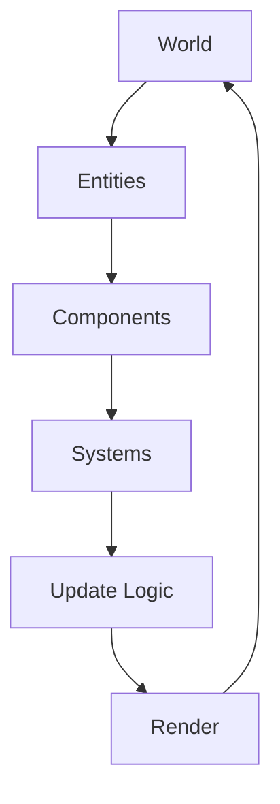

# MyEngine_Core - Análisis Completo del Motor ECS

## Índice

1. [Introducción y Filosofía ECS](#introducción-y-filosofía-ecs)
2. [Arquitectura del Motor](#arquitectura-del-motor)
3. [Entidades - El Fundamento](#entidades---el-fundamento)
4. [Componentes - Los Datos](#componentes---los-datos)
5. [Sistemas - La Lógica](#sistemas---la-lógica)
6. [World Manager - El Administrador](#world-manager---el-administrador)
7. [MyProgram - El Corazón del Motor](#myprogram---el-corazón-del-motor)
8. [Servicios Auxiliares](#servicios-auxiliares)
9. [Casos de Uso y Patrones](#casos-de-uso-y-patrones)
10. [Recomendaciones y Mejores Prácticas](#recomendaciones-y-mejores-prácticas)

---

## Introducción y Filosofía ECS

### ¿Qué es Entity Component System?

El patrón **Entity Component System (ECS)** es un paradigma arquitectónico utilizado en el desarrollo de juegos que separa la lógica de la aplicación en tres pilares fundamentales:

- **Entidades (Entities)**: Contenedores únicos identificados por un ID
- **Componentes (Components)**: Estructuras de datos puros sin lógica
- **Sistemas (Systems)**: Lógica que opera sobre grupos de componentes

### Filosofía del MyEngine_Core

MyEngine_Core implementa una versión robusta y práctica del patrón ECS diseñada específicamente para MonoGame Framework, con las siguientes características distintivas:

**🎯 Principios Fundamentales:**
- **Composición sobre Herencia**: Las entidades se construyen combinando componentes
- **Separación de Responsabilidades**: Datos (componentes) separados de lógica (sistemas)
- **Cache Friendliness**: Procesamiento por lotes para mejor performance
- **Modularidad Extrema**: Cada sistema y componente es independiente y reutilizable

**🏗️ Beneficios Arquitectónicos:**
- **Escalabilidad**: Fácil agregar nuevas funcionalidades sin afectar código existente
- **Performance**: Procesamiento optimizado por grupos de componentes
- **Mantenibilidad**: Código limpio, testeable y fácil de debuggear
- **Flexibilidad**: Entidades altamente configurables en tiempo de ejecución

---

## Arquitectura del Motor

### Estructura de Alto Nivel

```
MyEngine_Core/
├── ECS/                          # Núcleo del sistema ECS
│   ├── MyEntities/               # Definición de entidades base
│   ├── MyComponents/             # Todos los componentes del sistema
│   ├── MySystems/                # Lógica de procesamiento
│   └── world_manager.cs          # Administrador central del mundo ECS
├── MyGraphics/                   # Sistema gráfico y renderizado
├── MyAudio/                      # Control de audio y sonido
├── MyScenes/                     # Gestión de escenas
├── MyServices/                   # Servicios auxiliares
└── MyProgram.cs                  # Punto de entrada y configuración
```

### Flujo de Datos



---

## Entidades - El Fundamento

### La Clase EntidadPadre

```csharp
public class EntidadPadre
{
    public readonly int Id;
    private Dictionary<Type, object> _components = new();
}
```

#### **Análisis Detallado**

**🔍 Responsabilidad Central:**
La clase `EntidadPadre` actúa como un **contenedor genérico** que puede albergar cualquier combinación de componentes. Su diseño minimalista es intencional - no contiene lógica de juego, solo gestión de componentes.

**🏗️ Arquitectura Interna:**

1. **ID Inmutable**: 
   - Cada entidad tiene un identificador único e inmutable
   - Asignado por el World Manager al momento de creación
   - Permite referenciación rápida y consistente

2. **Diccionario de Componentes**:
   - Utiliza `Dictionary<Type, object>` para almacenamiento
   - Key: Tipo del componente (ej: `typeof(TransformComponent)`)
   - Value: Instancia del componente como object (requiere casting)

**📝 API Principal:**

```csharp
// Agregar componente
entity.AddComponent<TransformComponent>(new TransformComponent());

// Verificar existencia
if (entity.HasComponent<SpriteComponent>()) { ... }

// Obtener componente
var transform = entity.GetComponent<TransformComponent>();
```

#### **Fortalezas del Diseño**

✅ **Flexibilidad Máxima**: Puede contener cualquier combinación de componentes  
✅ **Type Safety**: Utiliza generics para evitar errores de casting  
✅ **Performance**: Acceso O(1) a componentes via Dictionary  
✅ **Simplicidad**: API intuitiva y fácil de usar  

#### **Consideraciones Técnicas**

⚠️ **Boxing/Unboxing**: El uso de `object` requiere casting, pero es inevitable en este diseño  
⚠️ **Exception Handling**: `GetComponent<T>()` lanza excepción si no existe el componente  
⚠️ **Memory**: Cada entidad mantiene su propio diccionario (overhead mínimo)

#### **Patrones de Uso Recomendados**

```csharp
// ✅ Construcción por composición
var enemy = world.CreateEntity();
enemy.AddComponent(new TransformComponent { Position = new Vector2(100, 100) });
enemy.AddComponent(new SpriteComponent(enemyTexture));
enemy.AddComponent(new RigidbodyComponent { Mass = 1.5f });
enemy.AddComponent(new AIComponent { State = AIState.Patrol });

// ✅ Verificación segura antes de acceso
if (entity.HasComponent<HealthComponent>())
{
    var health = entity.GetComponent<HealthComponent>();
    health.TakeDamage(damage);
}

// ✅ Entidades especializadas via composición
var staticProp = world.CreateEntity();
staticProp.AddComponent(new TransformComponent());
staticProp.AddComponent(new SpriteComponent(propTexture));
// Sin RigidbodyComponent = no se mueve

var dynamicObject = world.CreateEntity();
dynamicObject.AddComponent(new TransformComponent());
dynamicObject.AddComponent(new SpriteComponent(objectTexture));
dynamicObject.AddComponent(new RigidbodyComponent()); // ¡Ahora puede moverse!
```

---

## Componentes - Los Datos

Los componentes en MyEngine_Core son **estructuras de datos puros** que definen las propiedades y características de las entidades. Cada componente tiene una responsabilidad específica y bien definida.

---

### 🌍 TransformComponent - Posición en el Mundo

```csharp
public class TransformComponent
{
    public Vector2 Position { get; set; }
    public float Rotation { get; set; }
    public Vector2 Scale { get; set; } = Vector2.One;
    
    // Métodos de conveniencia
    public void X(float x);
    public void Y(float y);
    public void SetPosition(Vector2 position);
    public void MoverIzquierda(float movement);
    public void MoverDerecha(float movement);
    // ... etc
}
```

#### **Propósito y Responsabilidad**
El `TransformComponent` es el **componente más fundamental** del sistema. Define la posición, rotación y escala de una entidad en el mundo 2D. Es requerido por prácticamente todos los sistemas que necesitan conocer la ubicación de una entidad.

#### **Análisis Detallado**

**📍 Position (Vector2):**
- Coordenadas X,Y en el mundo 2D
- Unidades en píxeles por defecto
- Base para todos los cálculos de renderizado y física

**🔄 Rotation (float):**
- Rotación en radianes
- 0 = sin rotación, π/2 = 90 grados
- Utilizado por RenderSystem para rotación visual

**📏 Scale (Vector2):**
- Factor de escala independiente para X e Y
- Vector2.One = tamaño original (100%)
- Permite efectos de "squash and stretch"

**🛠️ Métodos Auxiliares:**
Los métodos como `MoverIzquierda()`, `MoverDerecha()` son **helpers** que simplifican operaciones comunes, aunque puedes modificar Position directamente.

#### **Casos de Uso Típicos**

```csharp
// Posicionamiento inicial
transform.Position = new Vector2(screenWidth/2, screenHeight/2);

// Movimiento suave
transform.Position += velocity * deltaTime;

// Rotación hacia objetivo
Vector2 direction = target - transform.Position;
transform.Rotation = (float)Math.Atan2(direction.Y, direction.X);

// Efectos de escala
transform.Scale = Vector2.One * (1.0f + pulseEffect);
```

**💡 Recomendaciones:**
- Siempre incluir en entidades que necesiten posición
- Usar métodos helper para operaciones simples
- Combinar con RigidbodyComponent para física

---

### 🎨 SpriteComponent - Representación Visual

```csharp
public class SpriteComponent
{
    public TextureRegion Region { get; set; }
    public Color Color { get; set; } = Color.White;
    public Vector2 Origin { get; set; } = Vector2.Zero;
    public SpriteEffects Effects { get; set; } = SpriteEffects.None;
    public float LayerDepth { get; set; } = 0.0f;
    
    public void CenterOrigin();
    public void Draw(SpriteBatch spriteBatch, TransformComponent transform);
}
```

#### **Propósito y Responsabilidad**
El `SpriteComponent` define **cómo se ve una entidad en pantalla**. Contiene toda la información necesaria para renderizar un sprite 2D, desde la textura hasta efectos visuales.

#### **Análisis Detallado**

**🖼️ TextureRegion:**
- Referencia a la porción de textura a renderizar
- Permite usar spritesheets y atlas de texturas
- Base del sistema de animaciones

**🎨 Color (Color.White por defecto):**
- Tinte aplicado al sprite
- Color.White = sin modificación
- Permite efectos como damage flash (Color.Red)

**⚓ Origin (Vector2.Zero por defecto):**
- Punto de origen para rotación y escala
- Vector2.Zero = esquina superior izquierda
- CenterOrigin() = centro del sprite (más común)

**🔀 SpriteEffects:**
- FlipHorizontally, FlipVertically
- Útil para direcciones de movimiento
- No requiere texturas adicionales

**📚 LayerDepth (0.0f por defecto):**
- Determina orden de renderizado
- 0.0f = primer plano, 1.0f = fondo
- RenderSystem ordena automáticamente

#### **Métodos Importantes**

**CenterOrigin():**
```csharp
public void CenterOrigin()
{
    Origin = new Vector2(Region.Width, Region.Height) * 0.5f;
}
```
Establece el origen al centro del sprite. **Altamente recomendado** para la mayoría de casos.

**Draw():**
```csharp
public void Draw(SpriteBatch spriteBatch, TransformComponent transform)
{
    Region.Draw(spriteBatch, transform.Position, Color, 
               transform.Rotation, Origin, transform.Scale, Effects, LayerDepth);
}
```
Renderiza el sprite usando datos del TransformComponent.

#### **Patrones de Uso**

```csharp
// Setup básico
var sprite = new SpriteComponent(playerTextureRegion);
sprite.CenterOrigin(); // ¡Importante para rotación correcta!
entity.AddComponent(sprite);

// Efectos visuales
sprite.Color = Color.Red;           // Tinte rojo
sprite.Effects = SpriteEffects.FlipHorizontally; // Voltear
sprite.LayerDepth = 0.1f;          // Atrás de otros sprites

// Animaciones de color
sprite.Color = Color.White * alpha; // Fade in/out
```

**💡 Mejores Prácticas:**
- Siempre usar CenterOrigin() a menos que necesites origen específico
- Usar LayerDepth para controlar orden de renderizado
- Combinar con AnimationComponent para sprites animados

---

### 🏃‍♂️ RigidbodyComponent - Física Básica

```csharp
public class RigidbodyComponent
{
    public Vector2 Velocity;
    public float Mass;
}
```

#### **Propósito y Responsabilidad**
El `RigidbodyComponent` convierte una entidad estática en un **objeto físico dinámico**. Permite que la entidad responda a fuerzas, gravedad, y colisiones.

#### **Análisis Detallado**

**🏃 Velocity (Vector2):**
- Velocidad actual en píxeles por segundo
- Vector2.Zero = sin movimiento
- Modificada por PhysicsSystem cada frame

**⚖️ Mass (float):**
- Masa del objeto para cálculos físicos
- Mass = 0: Objeto inmóvil (static)
- Mass > 0: Objeto dinámico que responde a fuerzas

#### **Diseño Minimalista**
Este componente tiene un diseño **extremadamente simple** por design. La complejidad reside en PhysicsSystem, no en el componente.

#### **Relación con Otros Sistemas**

**PhysicsSystem:**
```csharp
// Aplica gravedad
if (rigidbody.Mass > 0)
    rigidbody.Velocity += gravity * deltaTime;

// Actualiza posición
transform.Position += rigidbody.Velocity * deltaTime;
```

**InputSystem:**
```csharp
// Movimiento por impulso
rigidbody.Velocity += direction * speed * deltaTime;
```

#### **Casos de Uso Típicos**

```csharp
// Personaje jugable
var rb = new RigidbodyComponent { Mass = 1.0f, Velocity = Vector2.Zero };

// Proyectil
var bullet = new RigidbodyComponent { Mass = 0.1f, Velocity = direction * speed };

// Plataforma móvil
var platform = new RigidbodyComponent { Mass = 5.0f, Velocity = new Vector2(50, 0) };
```

**💡 Consejos de Uso:**
- Mass = 0 para objetos que no deben moverse por gravedad
- Velocity inicial para proyectiles y objetos lanzados
- Combinar con ColliderComponent para detección de colisiones

---

### 🎯 ColliderComponent - Detección de Colisiones

```csharp
public class ColliderComponent
{
    public Vector2 Size { get; set; }
    public Vector2 Offset { get; set; }
    public bool IsTrigger { get; set; }
    public string Tag { get; set; }
    public int Layer { get; set; }
    public int CollisionMask { get; set; }
    public bool IsEnabled { get; set; }
    
    public Rectangle GetBounds(Vector2 position, Vector2 scale);
    public bool CanCollideWith(ColliderComponent other);
}
```

#### **Propósito y Responsabilidad**
El `ColliderComponent` define el **área de colisión** de una entidad y controla con qué puede colisionar. Implementa un sistema sofisticado de detección con capas y filtros.

#### **Análisis Detallado**

**📐 Size (Vector2):**
- Dimensiones del collider en píxeles
- Independiente del sprite visual
- Base para AABB (Axis-Aligned Bounding Box)

**📍 Offset (Vector2):**
- Desplazamiento relativo a la posición de la entidad
- Permite ajustar collider sin mover la entidad
- Útil para hitboxes precisos

**👻 IsTrigger (bool):**
- `false`: Colisión física (bloqueante)
- `true`: Solo detección, sin bloqueo
- Perfecto para zonas de activación

**🏷️ Tag (string):**
- Identificador textual del tipo de collider
- "Player", "Enemy", "Powerup", etc.
- Usado para lógica específica de colisión

**🎚️ Layer System:**
- **Layer**: Capa a la que pertenece este collider
- **CollisionMask**: Con qué capas puede colisionar
- Sistema de bits para performance optimizada

**⚡ IsEnabled (bool):**
- Activar/desactivar temporalmente el collider
- Útil para power-ups de invencibilidad

#### **Métodos Avanzados**

**GetBounds():**
```csharp
public Rectangle GetBounds(Vector2 position, Vector2 scale)
{
    return new Rectangle(
        (int)(position.X + Offset.X * scale.X),
        (int)(position.Y + Offset.Y * scale.Y),
        (int)(Size.X * scale.X),
        (int)(Size.Y * scale.Y)
    );
}
```
Calcula el rectángulo de colisión actual considerando posición, offset y escala.

**CanCollideWith():**
```csharp
public bool CanCollideWith(ColliderComponent other)
{
    if (!IsEnabled || !other.IsEnabled) return false;
    return (CollisionMask & (1 << other.Layer)) != 0;
}
```
Determina si dos colliders pueden colisionar usando máscaras de bits.

#### **Sistema de Capas Explicado**

```csharp
// Definir capas
const int PLAYER_LAYER = 0;     // Bit 0
const int ENEMY_LAYER = 1;      // Bit 1
const int PROJECTILE_LAYER = 2; // Bit 2
const int ENVIRONMENT_LAYER = 3;// Bit 3

// Player colisiona con enemies y environment
playerCollider.Layer = PLAYER_LAYER;
playerCollider.CollisionMask = (1 << ENEMY_LAYER) | (1 << ENVIRONMENT_LAYER);

// Enemy proyectil solo colisiona con player
enemyBullet.Layer = PROJECTILE_LAYER;
enemyBullet.CollisionMask = (1 << PLAYER_LAYER);
```

#### **Casos de Uso Típicos**

```csharp
// Player hitbox
var playerCollider = new ColliderComponent(32, 48)
{
    Offset = new Vector2(0, -8), // Ajustar a sprite
    Tag = "Player",
    Layer = 0,
    CollisionMask = ~0 // Colisiona con todo
};

// Trigger zone
var checkpoint = new ColliderComponent(64, 64)
{
    IsTrigger = true,
    Tag = "Checkpoint"
};

// Enemy con colisión específica
var enemy = new ColliderComponent(24, 24)
{
    Tag = "Enemy",
    Layer = 1,
    CollisionMask = (1 << 0) | (1 << 3) // Solo player y environment
};
```

**💡 Mejores Prácticas:**
- Usar Tags descriptivos para lógica de gameplay
- IsTrigger=true para zonas de activación
- Ajustar Offset para hitboxes precisos
- Planificar sistema de capas antes de implementar

---

### 🎮 InputComponent - Control de Usuario

```csharp
public class InputComponent
{
    // Control flags
    public bool IsEnabled { get; set; } = true;
    public bool UseKeyboard { get; set; } = true;
    public bool UseGamepad { get; set; } = true;
    public bool UseMouse { get; set; } = false;
    
    // Movement settings
    public float MoveSpeed { get; set; } = 200f;
    public float Acceleration { get; set; } = 1000f;
    public bool FollowMouse { get; set; } = false;
    public float DeadZone { get; set; } = 0.1f;
    
    // Key mappings
    public Keys MoveUpKey { get; set; } = Keys.W;
    public Keys JumpKey { get; set; } = Keys.Space;
    // ... más mappings
    
    // Callbacks
    public Action<EntidadPadre> OnJump { get; set; }
    public Action<EntidadPadre> OnAction { get; set; }
    public Action<EntidadPadre, Vector2> OnMouseClick { get; set; }
    // ... más callbacks
}
```

#### **Propósito y Responsabilidad**
El `InputComponent` convierte una entidad en **controlable por el usuario**. Proporciona un sistema de input flexible que soporta múltiples dispositivos y callbacks personalizables.

#### **Análisis Arquitectónico**

**🎛️ Sistema de Flags:**
- Control granular sobre qué dispositivos usar
- Permite desactivar input temporalmente
- Soporte multi-dispositivo simultáneo

**⚙️ Configuración de Movimiento:**
- **MoveSpeed**: Velocidad base en píxeles/segundo
- **Acceleration**: Para movimiento suave (no implementado por defecto)
- **DeadZone**: Zona muerta para analógicos

**🗝️ Key Mapping Configurable:**
- Todas las teclas son personalizables
- Separación clara entre acciones y teclas
- Soporte completo para gamepad

**📞 Sistema de Callbacks:**
- **Eventos basados en Actions**: Máxima flexibilidad
- **Parámetros contextuales**: Entity y posición cuando relevante
- **Desacoplamiento**: Lógica específica fuera del componente

#### **Callbacks Disponibles**

```csharp
// Acciones instantáneas
OnJump?.Invoke(entity);           // Salto
OnAction?.Invoke(entity);         // Acción principal
OnInteract?.Invoke(entity);       // Interacción

// Acciones con contexto
OnMouseClick?.Invoke(entity, mousePos);     // Click con posición
OnMove?.Invoke(entity, movement);           // Movimiento continuo
OnSprintChanged?.Invoke(entity, isSprinting); // Cambio de estado
```

#### **Patrones de Uso Avanzados**

```csharp
// Setup completo para personaje principal
var inputComp = new InputComponent(300f)
{
    UseKeyboard = true,
    UseGamepad = true,
    DeadZone = 0.15f
};

// Jump mechanics
inputComp.OnJump = (entity) =>
{
    if (entity.HasComponent<RigidbodyComponent>())
    {
        var rb = entity.GetComponent<RigidbodyComponent>();
        if (IsGrounded(entity)) // Tu lógica de suelo
        {
            rb.Velocity.Y = -jumpForce;
            PlaySound("jump");
        }
    }
};

// Combat system
inputComp.OnAction = (entity) =>
{
    if (entity.HasComponent<WeaponComponent>())
    {
        var weapon = entity.GetComponent<WeaponComponent>();
        weapon.Fire();
    }
};

// Interaction system
inputComp.OnInteract = (entity) =>
{
    var nearby = FindNearbyInteractables(entity);
    nearby?.Interact(entity);
};

entity.AddComponent(inputComp);
```

**💡 Ventajas del Diseño:**
- **Flexibilidad**: Callbacks permiten cualquier comportamiento
- **Reutilización**: Mismo componente para diferentes tipos de control
- **Configurabilidad**: Keys y settings personalizables
- **Extensibilidad**: Fácil agregar nuevos tipos de input

---

### 🎬 AnimationComponent - Animaciones Avanzadas

```csharp
public class AnimationComponent
{
    public Dictionary<string, Animation> Animations { get; set; }
    public Animation CurrentAnimation { get; set; }
    public int CurrentFrame { get; set; }
    public TimeSpan ElapsedTime { get; set; }
    public bool IsPlaying { get; set; }
    public bool IsLooping { get; set; }
    
    // Events
    public Action<EntidadPadre> OnAnimationComplete { get; set; }
    public Action<EntidadPadre> OnAnimationLoop { get; set; }
    
    public void AddAnimation(string name, Animation animation);
    public void AddAnimationFromSpriteSheet(string name, ...);
}
```

#### **Propósito y Responsabilidad**
El `AnimationComponent` proporciona un **sistema completo de animaciones** con soporte para múltiples clips, eventos, y control de reproducción. Se integra perfectamente con SpriteComponent.

#### **Análisis del Sistema de Animaciones**

**🗂️ Gestión de Múltiples Animaciones:**
- Diccionario de animaciones por nombre
- Cambio dinámico entre animaciones
- Animaciones reutilizables entre entidades

**⏯️ Control de Reproducción:**
- **IsPlaying**: Pausa/resume sin perder progreso
- **IsLooping**: Repetición automática
- **CurrentFrame**: Frame actual (read/write)
- **ElapsedTime**: Tiempo transcurrido en frame actual

**📅 Eventos de Animación:**
- **OnAnimationComplete**: Al finalizar (no-loop)
- **OnAnimationLoop**: Al completar un ciclo
- Útiles para triggers de gameplay

#### **Método AddAnimationFromSpriteSheet**

```csharp
public void AddAnimationFromSpriteSheet(string name, TextureRegion baseRegion,
    int frameCount, int frameWidth, int frameHeight, TimeSpan delay)
{
    var frames = new List<TextureRegion>();
    
    for (int i = 0; i < frameCount; i++)
    {
        int x = baseRegion.SourceRectangle.X + (i * frameWidth);
        int y = baseRegion.SourceRectangle.Y;
        
        frames.Add(new TextureRegion(baseRegion.Texture, x, y, frameWidth, frameHeight));
    }
    
    Animations[name] = new Animation(frames, delay);
}
```

**Características:**
- Genera automáticamente frames desde spritesheet
- Horizontal layout (frames en fila)
- Simplifica enormemente setup de animaciones

#### **Casos de Uso Típicos**

```csharp
// Setup de animación completa
var animComp = new AnimationComponent();

// Desde spritesheet (método recomendado)
animComp.AddAnimationFromSpriteSheet("walk", walkTexture, 
    8, 32, 32, TimeSpan.FromMilliseconds(100));

animComp.AddAnimationFromSpriteSheet("attack", attackTexture,
    6, 48, 48, TimeSpan.FromMilliseconds(80));

// Eventos de animación
animComp.OnAnimationComplete = (entity) =>
{
    if (animComp.CurrentAnimation == animComp.Animations["attack"])
    {
        // Volver a idle después de atacar
        AnimationSystem.PlayAnimation(entity, "idle", true);
    }
};

// Control de animación desde otros sistemas
AnimationSystem.PlayAnimation(player, "walk", true);
```

**💡 Workflow Recomendado:**
1. Crear spritesheets con frames de tamaño uniforme
2. Usar AddAnimationFromSpriteSheet para setup rápido
3. Configurar eventos para transiciones automáticas
4. Controlar desde sistemas de gameplay (AI, Input, etc.)

---

### 🗺️ TilemapComponent - Mapas de Tiles

```csharp
public class TilemapComponent
{
    public int Rows { get; }
    public int Columns { get; }
    public int Count { get; }
    public Vector2 Scale { get; set; }
    public float TileWidth { get; }
    public float TileHeight { get; }
    
    public void SetTile(int index, int tilesetID);
    public void SetTile(int column, int row, int tilesetID);
    public TextureRegion GetTile(int index);
    public void Draw(SpriteBatch spriteBatch);
    
    public static TilemapComponent FromFile(ContentManager content, string filename);
}
```

#### **Propósito y Responsabilidad**
El `TilemapComponent` permite crear **grandes mundos eficientemente** usando un sistema de tiles reutilizables. Perfecto para backgrounds, niveles, y mundos de tipo retro/pixel art.

#### **Arquitectura del Sistema**

**🧩 Componentes del Sistema:**
- **TilemapComponent**: Contiene el layout de tiles
- **Tileset**: Conjunto de tiles disponibles
- **TextureRegion**: Tiles individuales

**📊 Estructura de Datos:**
```csharp
private readonly Tileset _tileset;     // Conjunto de tiles
protected int[] _tiles;                // Layout del mapa
```

**🎯 Eficiencia:**
- Array unidimensional para máxima performance
- Conversión automática columna/fila ↔ índice
- Renderizado batch optimizado

#### **Carga desde Archivos XML**

**Formato XML:**
```xml
<Tilemap>
    <Tileset region="0 0 256 256" tileWidth="32" tileHeight="32">
        textures/tileset_grass
    </Tileset>
    <Tiles>
        1 1 1 1 1 1 1 1
        1 0 0 0 0 0 0 1
        1 0 2 3 3 2 0 1
        1 0 0 0 0 0 0 1
        1 1 1 1 1 1 1 1
    </Tiles>
</Tilemap>
```

**Características del Formato:**
- **1-based indexing**: 0 = tile vacío, 1+ = tile válido
- **Conversión automática**: Se convierte a 0-based internamente
- **Layout visual**: El XML refleja el mapa visualmente
- **Flexibilidad**: Cualquier tamaño de tile

#### **Uso Práctico**

```csharp
// Carga desde archivo
var tilemap = TilemapComponent.FromFile(Content, "maps/level1.xml");
tilemap.Scale = new Vector2(2.0f, 2.0f); // 2x scale

// Creación programática
var tileset = new Tileset(grassTexture, 32, 32);
var tilemap = new TilemapComponent(tileset, 20, 15); // 20x15 tiles

// Llenar programáticamente
for (int x = 0; x < tilemap.Columns; x++)
{
    for (int y = 0; y < tilemap.Rows; y++)
    {
        int tileId = (x == 0 || x == tilemap.Columns-1 || 
                     y == 0 || y == tilemap.Rows-1) ? 1 : 0;
        tilemap.SetTile(x, y, tileId);
    }
}

// Agregar a entidad
var mapEntity = world.CreateEntity();
mapEntity.AddComponent(new TransformComponent());
mapEntity.AddComponent(tilemap);
```

**💡 Casos de Uso:**
- **Backgrounds**: Fondos de niveles complejos
- **Collision Maps**: Combinado con ColliderComponent
- **Procedural Generation**: Generación algorítmica
- **Level Editors**: Base para herramientas de edición

---

## Sistemas - La Lógica

Los sistemas son el **corazón del motor ECS**. Contienen toda la lógica de procesamiento y operan sobre grupos de entidades que poseen componentes específicos.

---

### 🎨 RenderSystem - Motor de Renderizado

```csharp
public class RenderSystem : ISystem
{
    private SpriteBatch _spriteBatch;
    private Camara2D _camera;
    private World _world;
    private GraphicsDevice _graphicsDevice;
    
    public void Draw(GameTime gameTime);
    public void Draw(GameTime gameTime, SpriteSortMode sortMode, ...);
}
```

#### **Responsabilidad y Arquitectura**

El `RenderSystem` es responsable del **renderizado completo** de todas las entidades visuales. Implementa un pipeline sofisticado que maneja:

- **Ordenamiento automático** por LayerDepth
- **Renderizado por lotes** para performance
- **Soporte de cámaras** 2D con transformaciones
- **Múltiples tipos de renderizado** (Sprites y Tilemaps)

#### **Pipeline de Renderizado Detallado**

```csharp
public void Draw(GameTime gameTime)
{
    // 1. OBTENER ENTIDADES RENDERIZABLES
    var entities = _world.GetAllEntities();
    
    // 2. FILTRAR Y ORDENAR
    var sortedEntities = entities
        .Where(e => e.HasComponent<TransformComponent>() && 
                   (e.HasComponent<SpriteComponent>() || e.HasComponent<TilemapComponent>()))
        .OrderBy(e => 
        {
            if (e.HasComponent<SpriteComponent>())
                return e.GetComponent<SpriteComponent>().LayerDepth;
            return 0f; // Tilemaps al fondo
        })
        .ToList();

    // 3. CONFIGURAR SPRITEBATCH
    _spriteBatch.Begin(
        SpriteSortMode.Deferred,        // Ordenamiento manual
        BlendState.AlphaBlend,          // Transparencia
        SamplerState.PointClamp,        // Pixel-perfect
        null, null, null,
        _camera?.GetTransform());       // Transformación de cámara

    // 4. RENDERIZAR TILEMAPS (BACKGROUNDS)
    foreach (var entity in sortedEntities)
    {
        if (entity.HasComponent<TilemapComponent>())
        {
            RenderTilemap(entity);
        }
    }

    // 5. RENDERIZAR SPRITES
    foreach (var entity in sortedEntities)
    {
        if (entity.HasComponent<SpriteComponent>())
        {
            RenderSprite(entity);
        }
    }

    // 6. FINALIZAR BATCH
    _spriteBatch.End();
}
```

#### **Análisis de Componentes**

**🎯 Filtrado Inteligente:**
```csharp
.Where(e => e.HasComponent<TransformComponent>() && 
           (e.HasComponent<SpriteComponent>() || e.HasComponent<TilemapComponent>()))
```
Solo procesa entidades que:
- Tienen posición (TransformComponent)
- Tienen representación visual (Sprite O Tilemap)

**📊 Ordenamiento Automático:**
```csharp
.OrderBy(e => e.HasComponent<SpriteComponent>() ? 
              e.GetComponent<SpriteComponent>().LayerDepth : 0f)
```
- LayerDepth más bajo = renderiza primero (atrás)
- Tilemaps siempre al fondo (LayerDepth = 0)
- Control preciso del Z-ordering

**🎥 Integración de Cámara:**
```csharp
_camera?.GetTransform()
```
- Matriz de transformación de la cámara
- Automáticamente aplica posición, rotación, zoom
- null = sin cámara (coordenadas de pantalla)

#### **Renderizado de Sprites**

```csharp
private void RenderSprite(EntidadPadre entity)
{
    var transform = entity.GetComponent<TransformComponent>();
    var sprite = entity.GetComponent<SpriteComponent>();
    
    // El sprite se dibuja a sí mismo usando transform
    sprite.Draw(_spriteBatch, transform);
}
```

**Características:**
- **Desacoplamiento**: Sprite conoce cómo dibujarse
- **Datos del Transform**: Posición, rotación, escala aplicadas automáticamente
- **Propiedades del Sprite**: Color, origin, effects aplicadas

#### **Renderizado de Tilemaps**

```csharp
private void RenderTilemap(EntidadPadre entity)
{
    var transform = entity.GetComponent<TransformComponent>();
    var tilemap = entity.GetComponent<TilemapComponent>();
    
    // Aplicar escala del transform al tilemap
    var oldScale = tilemap.Scale;
    tilemap.Scale = transform.Scale;
    
    tilemap.Draw(_spriteBatch);
    
    // Restaurar escala original
    tilemap.Scale = oldScale;
}
```

**Consideraciones:**
- **Escala Temporal**: Aplica escala del transform sin modificar permanentemente
- **Posición**: Tilemaps se dibujan en posición fija (0,0) típicamente
- **Performance**: Dibuja todos los tiles visibles de una vez

#### **Método Draw Avanzado**

```csharp
public void Draw(GameTime gameTime, SpriteSortMode sortMode, BlendState blendState, 
    SamplerState samplerState, DepthStencilState depthStencilState, 
    RasterizerState rasterizerState, Effect effect)
```

**Propósito:**
- Control total sobre configuración de SpriteBatch
- Shaders personalizados via Effect
- Modos de blending especiales
- Casos de uso avanzados

**💡 Mejores Prácticas:**
- Usar Draw() básico para mayoría de casos
- Draw() avanzado solo para efectos especiales
- Una llamada a Draw() por frame para máximo performance
- Ordenar sprites por textura para mejor batching

---

### ⚡ PhysicsSystem - Motor de Física

```csharp
public class PhysicsSystem : ISystem
{
    private Vector2 _gravity = new Vector2(0, 980f);
    private float _damping = 0.99f;
    
    public void Update(GameTime gameTime);
    public void ApplyImpulse(EntidadPadre entity, Vector2 impulse);
    public void ApplyForce(EntidadPadre entity, Vector2 force, float deltaTime);
}
```

#### **Responsabilidad y Filosofía**

El `PhysicsSystem` implementa un **motor de física 2D completo** que incluye:

- **Integración de velocidad**: Conversión velocity → position
- **Simulación de gravedad**: Aceleración constante hacia abajo
- **Sistema de damping**: Reducción gradual de velocidad
- **Detección AABB**: Axis-Aligned Bounding Box collision
- **Resolución de colisiones**: Separación y respuesta física

#### **Loop Principal de Física**

```csharp
public void Update(GameTime gameTime)
{
    float deltaTime = (float)gameTime.ElapsedGameTime.TotalSeconds;
    
    // OBTENER ENTIDADES FÍSICAS
    var physicsEntities = _world.GetEntitiesWithComponents<TransformComponent, RigidbodyComponent>();

    foreach (var entity in physicsEntities)
    {
        var transform = entity.GetComponent<TransformComponent>();
        var rigidbody = entity.GetComponent<RigidbodyComponent>();

        // PASO 1: APLICAR GRAVEDAD
        if (rigidbody.Mass > 0)
        {
            rigidbody.Velocity += _gravity * deltaTime;
        }

        // PASO 2: APLICAR DAMPING
        rigidbody.Velocity *= _damping;

        // PASO 3: INTEGRACIÓN DE VELOCIDAD
        transform.Position += rigidbody.Velocity * deltaTime;

        // PASO 4: DETECCIÓN DE COLISIONES
        if (entity.HasComponent<ColliderComponent>())
        {
            var collider = entity.GetComponent<ColliderComponent>();
            CheckCollisions(entity, transform, rigidbody, collider);
        }
    }
}
```

#### **Análisis de Cada Paso**

**🌍 PASO 1: Aplicación de Gravedad**
```csharp
if (rigidbody.Mass > 0)
{
    rigidbody.Velocity += _gravity * deltaTime;
}
```

**Características:**
- **Conditional**: Solo aplica si Mass > 0
- **Físicamente Preciso**: Aceleración = Force / Mass, con Force constante
- **Configurable**: _gravity puede modificarse (luna, espacio, etc.)
- **Unidades**: Píxeles por segundo²

**🎭 PASO 2: Sistema de Damping**
```csharp
rigidbody.Velocity *= _damping;
```

**Propósito:**
- **Simulación de fricción**: Objetos se detienen gradualmente
- **Estabilidad numérica**: Evita acumulación de errores
- **Control de gameplay**: Ajustar "sensación" del movimiento
- **Rango**: 0.0 (detención inmediata) a 1.0 (sin damping)

**📐 PASO 3: Integración de Velocidad**
```csharp
transform.Position += rigidbody.Velocity * deltaTime;
```

**Modelo Físico:**
- **Integración de Euler**: Método simple y estable para 2D
- **Frame-rate Independent**: Usa deltaTime para consistencia
- **Unidades**: velocity en píxeles/segundo

**🎯 PASO 4: Detección de Colisiones**

Solo si la entidad tiene `ColliderComponent` - **composición en acción**.

#### **Sistema de Detección de Colisiones**

```csharp
private void CheckCollisions(EntidadPadre entity, TransformComponent transform, 
    RigidbodyComponent rigidbody, ColliderComponent collider)
{
    var otherEntities = _world.GetEntitiesWithComponents<TransformComponent, ColliderComponent>();
    
    foreach (var other in otherEntities)
    {
        if (other.Id == entity.Id) continue; // No colisionar consigo mismo

        var otherTransform = other.GetComponent<TransformComponent>();
        var otherCollider = other.GetComponent<ColliderComponent>();

        // DETECCIÓN AABB
        Rectangle bounds1 = GetBounds(transform, collider);
        Rectangle bounds2 = GetBounds(otherTransform, otherCollider);

        if (bounds1.Intersects(bounds2))
        {
            // RESOLUCIÓN DE COLISIÓN
            ResolveCollision(entity, other, bounds1, bounds2, rigidbody);
        }
    }
}
```

#### **Cálculo de Bounds**

```csharp
private Rectangle GetBounds(TransformComponent transform, ColliderComponent collider)
{
    return new Rectangle(
        (int)(transform.Position.X + collider.Offset.X),
        (int)(transform.Position.Y + collider.Offset.Y),
        (int)(collider.Size.X * transform.Scale.X),
        (int)(collider.Size.Y * transform.Scale.Y)
    );
}
```

**Características:**
- **Posición + Offset**: Collider puede estar desplazado de la entidad
- **Escala Aplicada**: Size se multiplica por transform.Scale
- **AABB**: Siempre rectangular, rotación no soportada (por performance)

#### **Resolución de Colisiones Avanzada**

```csharp
private void ResolveCollision(EntidadPadre entity1, EntidadPadre entity2, 
    Rectangle bounds1, Rectangle bounds2, RigidbodyComponent rigidbody1)
{
    // CALCULAR INTERSECCIÓN
    Rectangle intersection = Rectangle.Intersect(bounds1, bounds2);
    var transform1 = entity1.GetComponent<TransformComponent>();
    
    // ALGORITMO MTV (Minimum Translation Vector)
    if (intersection.Width < intersection.Height)
    {
        // SEPARACIÓN HORIZONTAL
        if (bounds1.Center.X < bounds2.Center.X)
        {
            // Empujar hacia la izquierda
            transform1.X(transform1.Position.X - intersection.Width);
            rigidbody1.Velocity.X = Math.Min(rigidbody1.Velocity.X, 0);
        }
        else
        {
            // Empujar hacia la derecha
            transform1.X(transform1.Position.X + intersection.Width);
            rigidbody1.Velocity.X = Math.Max(rigidbody1.Velocity.X, 0);
        }
    }
    else
    {
        // SEPARACIÓN VERTICAL
        if (bounds1.Center.Y < bounds2.Center.Y)
        {
            // Empujar hacia arriba
            transform1.Y(transform1.Position.Y - intersection.Height);
            rigidbody1.Velocity.Y = Math.Min(rigidbody1.Velocity.Y, 0);
        }
        else
        {
            // Empujar hacia abajo
            transform1.Y(transform1.Position.Y + intersection.Height);
            rigidbody1.Velocity.Y = Math.Max(rigidbody1.Velocity.Y, 0);
        }
    }
}
```

**Algoritmo MTV (Minimum Translation Vector):**
1. **Calcular intersección**: Área de solapamiento
2. **Determinar eje de separación**: Menor distancia (Width vs Height)
3. **Calcular dirección**: Comparar centros de los bounds
4. **Separar objetos**: Mover por distancia mínima
5. **Corregir velocidad**: Eliminar componente en dirección de colisión

#### **API de Fuerzas**

```csharp
// IMPULSO INSTANTÁNEO
public void ApplyImpulse(EntidadPadre entity, Vector2 impulse)
{
    if (entity.HasComponent<RigidbodyComponent>())
    {
        var rigidbody = entity.GetComponent<RigidbodyComponent>();
        if (rigidbody.Mass > 0)
        {
            rigidbody.Velocity += impulse / rigidbody.Mass; // F = ma, a = F/m
        }
    }
}

// FUERZA CONTINUA
public void ApplyForce(EntidadPadre entity, Vector2 force, float deltaTime)
{
    if (entity.HasComponent<RigidbodyComponent>())
    {
        var rigidbody = entity.GetComponent<RigidbodyComponent>();
        if (rigidbody.Mass > 0)
        {
            rigidbody.Velocity += (force / rigidbody.Mass) * deltaTime;
        }
    }
}
```

**Diferencias:**
- **ApplyImpulse**: Cambio instantáneo (salto, explosión)
- **ApplyForce**: Aplicación continua (motor de cohete, viento)

**💡 Casos de Uso:**
```csharp
// Salto del jugador
physicsSystem.ApplyImpulse(player, new Vector2(0, -500));

// Viento constante
physicsSystem.ApplyForce(leaves, new Vector2(50, 0), deltaTime);

// Explosión
foreach (var debris in nearbyObjects)
{
    Vector2 direction = debris.Position - explosionCenter;
    direction.Normalize();
    physicsSystem.ApplyImpulse(debris, direction * explosionForce);
}
```

---

### 🎮 InputSystem - Control de Usuario

```csharp
public class InputSystem : ISystem
{
    private KeyboardState _previousKeyboardState;
    private KeyboardState _currentKeyboardState;
    private MouseState _previousMouseState;
    private MouseState _currentMouseState;
    private GamePadState[] _previousGamePadStates;
    private GamePadState[] _currentGamePadStates;
}
```

#### **Arquitectura del Sistema de Input**

El `InputSystem` implementa un **sistema de input robusto y flexible** que:

- **Trackea estados**: Previous/Current para detectar cambios
- **Multi-dispositivo**: Keyboard, Mouse, hasta 4 Gamepads
- **Callback-driven**: Eventos específicos por entidad
- **Configurabilidad**: Key mapping personalizable por entidad

#### **Update Loop Principal**

```csharp
public void Update(GameTime gameTime)
{
    // ACTUALIZAR TODOS LOS